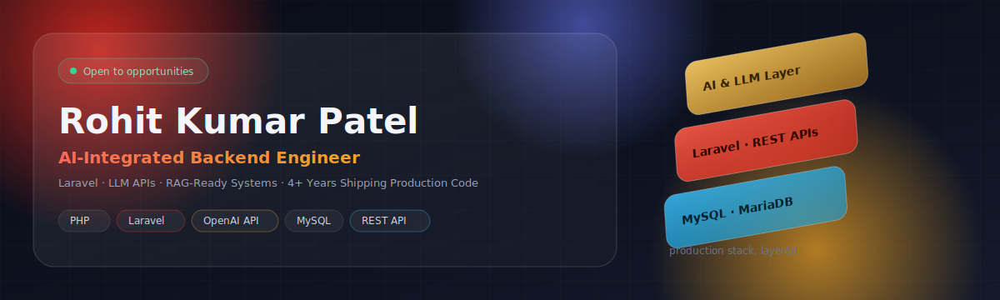
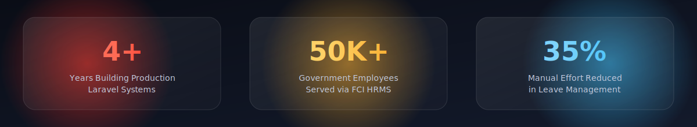

 

## 👋 About Me

I engineer the backbone most products never think about — until it breaks. Over **4+ years**, I've built Laravel systems that run at real institutional scale, then pushed further: wiring LLMs directly into those systems so they don't just serve data, they *reason* over it.

- 🏛️ Built the Leave Management core of a national HRMS serving **50,000+ government employees**
- 🤖 Shipped AI-assisted modules on **OpenAI-compatible APIs** — content generation, summarization, context-aware responses — inside production Laravel apps
- ⚙️ Designed a live pricing engine for enterprise materials manufacturing (Momentive), replacing manual configuration end to end
- 🧠 Actively pushing into **RAG pipelines, agentic workflows, and vector search** — where backend engineering is heading next
- 🎯 I optimize for systems that don't fall over at 2am, not just demos that impress in a meeting

> ⚡ *"Anyone can make it work. I make it work at scale, under load, six months after I've moved on to the next feature."*

 

## 📊 Impact, in Numbers

 

## 🤖 Where I Sit on the AI Curve

RAG, agentic systems, and multi-model orchestration aren't a separate track anymore — they're where backend engineering is going. Here's an honest split of what I've shipped vs. what I'm building toward:

<table>
<tr>
<td valign="top" width="50%">

**✅ Shipped in Production**
- Laravel AI SDK integration
- OpenAI-compatible API integration
- Prompt engineering for enterprise workflows
- Context-aware conversational features
- AI-assisted content generation & summarization

</td>
<td valign="top" width="50%">

**🔜 Actively Building Toward**
- RAG pipelines (vector search + retrieval)
- Agent orchestration (LangGraph / CrewAI)
- Vector databases (Pinecone / Qdrant)
- MCP (Model Context Protocol) tooling
- LLM evaluation & observability (Langfuse)

</td>
</tr>
</table>

 

## 🛠️ Tech Stack

  
  
  
  
  
  
  
  
  
  
  
  

 

<h3 align="center">📈 GitHub Stats</h3>
<table align="center">
  <tr>
    <td></td>
    <td></td>
    <td></td>
  </tr>
</table>

<h3 align="center">🏆 GitHub Trophies</h3>

  

<h3 align="center">📊 Contribution Activity</h3>

  

 

## 📫 Let's Connect

  
  

  💡 <i>"The best error message is the one that never shows up."</i>

  ⭐️ If my work is useful to you, a star on my repos goes a long way. ⭐️

